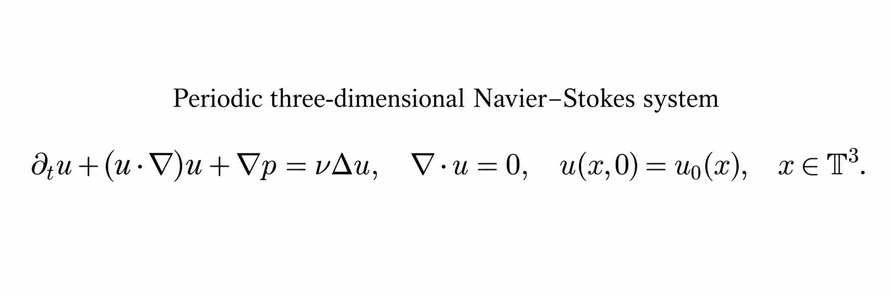
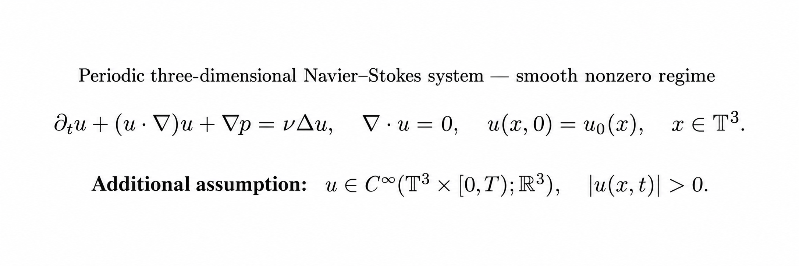

# Appendix D — Proof Status Conclusion and Chapter 1 Formula Figures

**Date:** 2026-09-14

**Timezone:** Asia/Taipei

**Repository:** `SunTung/RRG`

**Branch:** `main`
**Base commit before this appendix:** `378e98ec5ab602b23f5e64ea092894bed54cef16`

## D.1 Final proof-status conclusion

After reading the current Navier–Stokes research chain through STEP 172 and the PURE_MATH bridge sequence, the evidence-supported conclusion is:

> **The three-dimensional periodic Navier–Stokes Millennium problem has not yet been solved by the present record.**

This conclusion is not based on the absence of a public claim, incomplete formatting, or the number of papers. It follows from the remaining mathematical gate explicitly recorded in STEP 172:

- `derivation from existing exact identities: NOT AVAILABLE`;
- `derivation from standard pointwise critical estimate for arbitrary data: FAILS (small-data only)`;
- `P3: OPEN`.

The completed work contains exact structural identities, conditional equivalences, explicit counterexamples, and no-go results for several proposed closure mechanisms. Those are substantive research results. They do not yet provide a uniform global a priori estimate for arbitrary smooth divergence-free periodic initial data.

## D.2 Precise unresolved estimate

The narrow surviving candidate is a time-integrated critical absorption estimate of the schematic form

```text
∫_I N_{1/2}(t) dt
    <= (1-δ) ν ∫_I ||u(t)||_{Ḣ^{3/2}}² dt
       + F(E_0, ν, |I|),
```

where all of the following must be proved:

1. `δ>0` is uniform and does not deteriorate with frequency or truncation.
2. `F` is controlled independently by lower-order data and does not assume the desired critical or high-norm bound.
3. The estimate applies to arbitrary smooth divergence-free periodic initial data, not only small data, symmetry classes, fixed Fourier clusters, or finite Galerkin systems.
4. The estimate is stable at the comparable-scale terminal heat boundary.
5. Combined with the exact critical identity, it yields a recognized continuation bound and therefore global smoothness.

The standard pointwise estimate yields absorption only under a small critical-norm condition such as

```text
C ||u||_{Ḣ^{1/2}} < ν.
```

That is a conditional small-data regime and does not establish the arbitrary-data Millennium statement.

## D.3 Chapter 1 governing equation

The first standalone figure records the periodic incompressible three-dimensional Navier–Stokes initial-value problem:

```text
∂ₜu + (u·∇)u + ∇p = νΔu,
∇·u = 0,
u(x,0) = u₀(x),
x ∈ 𝕋³.
```



**Figure D.1.** Periodic three-dimensional Navier–Stokes system used in Chapter 1.

## D.4 Smooth nonzero-velocity variant

The second figure adds the explicit hypothesis

```text
u ∈ C∞(𝕋³ × [0,T); ℝ³),
|u(x,t)| > 0.
```



**Figure D.2.** Chapter 1 equation with the additional smooth nonzero-velocity hypothesis.

This condition must be classified correctly:

> `|u(x,t)|>0` is an additional restriction on the solution class. It is not a consequence proved from the Navier–Stokes equation, and it does not cover arbitrary smooth initial data allowed by the original Millennium problem.

Any argument that divides by `|u|`, defines `e=u/|u|`, or uses a velocity-direction coordinate is valid only on the nonzero set unless an independent treatment of velocity zeros is supplied.

## D.5 Evidence classification

| Item | Current classification | Global-regularity consequence |
|---|---|---|
| Projected, mild, and Lagrangian identities | Exact or conditionally equivalent on a smooth lifespan | No global continuation by themselves |
| Cofactor and determinant-one structure | Exact geometric structure | Does not control anisotropic condition number |
| Streamline and velocity-direction coordinates | Valid on their stated nonzero domain | Transverse derivatives and zero-set handling remain |
| Finite Fourier or graph verification | Finite/truncated evidence | Requires cutoff-uniform estimates |
| Unweighted graph compatibility deficit | Universal version falsified | Must be replaced by a weighted PDE estimate |
| Time-integrated strict critical absorption | Relevant and potentially effective | Not yet proved; P3 remains open |
| Millennium global regularity conclusion | Not established | No solution claim at this stage |

## D.6 Files, hashes, and implementation record

The repository was clean and synchronized with `origin/main` at base commit `378e98ec5ab602b23f5e64ea092894bed54cef16` before these appendix files were added.

| Appendix file | Content | SHA-256 before Git upload |
|---|---|---|
| `APPENDIX_D_FIGURE_D1_CHAPTER_1_NAVIER_STOKES_FORMULA.png` | Original Chapter 1 equation figure | `397E6814ABDC52FE77E3D41B966618FAF6B80732FD4CE6AF29519660405D49C0` |
| `APPENDIX_D_FIGURE_D2_CHAPTER_1_SMOOTH_NONZERO.png` | Equation plus smooth nonzero hypothesis | `9028BC24E9C495FFB89CEB710403E7FD141BC401678A0423D3C01B1074D100B1` |

Implementation sequence:

1. Re-read the final STEP 170–172 gate decisions.
2. Separated solved identities, negative/no-go results, and the open P3 estimate.
3. Continued the combined manuscript appendix sequence as Appendix D.
4. Added Figure D.1 and Figure D.2 as independent repository assets.
5. Recorded the pre-upload base commit and local SHA-256 values.
6. Required post-push verification: read back the remote commit and verify all three uploaded paths and blob hashes.

## D.7 Submission boundary

The combined long manuscript may be submitted as a structural-reduction, obstruction-localization, and no-go research article. It must not be submitted as a completed proof of global regularity unless Section D.2 is later proved for arbitrary smooth periodic data and the full implication to the Clay statement is independently checked.

## D.8 Associated long manuscript

The consolidated research article is archived as PAPER 11 in two synchronized formats:

- [PAPER 11 editable DOCX](PAPER_11_LONG_MANUSCRIPT_EXACT_STRUCTURAL_REDUCTIONS_NAVIER_STOKES_2026-09-14.docx)
- [PAPER 11 fixed-layout PDF](PAPER_11_LONG_MANUSCRIPT_EXACT_STRUCTURAL_REDUCTIONS_NAVIER_STOKES_2026-09-14.pdf)

| Manuscript file | Bytes | SHA-256 before Git upload |
|---|---:|---|
| `PAPER_11_LONG_MANUSCRIPT_EXACT_STRUCTURAL_REDUCTIONS_NAVIER_STOKES_2026-09-14.docx` | 54,712 | `11FF61078829067053F2B18FAFEB17051F51287C2ABEF536CC1A34BA2E638B51` |
| `PAPER_11_LONG_MANUSCRIPT_EXACT_STRUCTURAL_REDUCTIONS_NAVIER_STOKES_2026-09-14.pdf` | 145,031 | `B3E7A6B6653E7F0CBCD1D0C2048B07571E63EC12D86E5B1674FC05AF327AC9D4` |

The DOCX is the editable submission manuscript. The PDF is the visually verified A4 review copy. They share the same title, author identity, section order, theorem-status boundary, appendices A–C, and reference list. Appendix D remains a repository-side proof-status supplement created after the fixed manuscript render.
